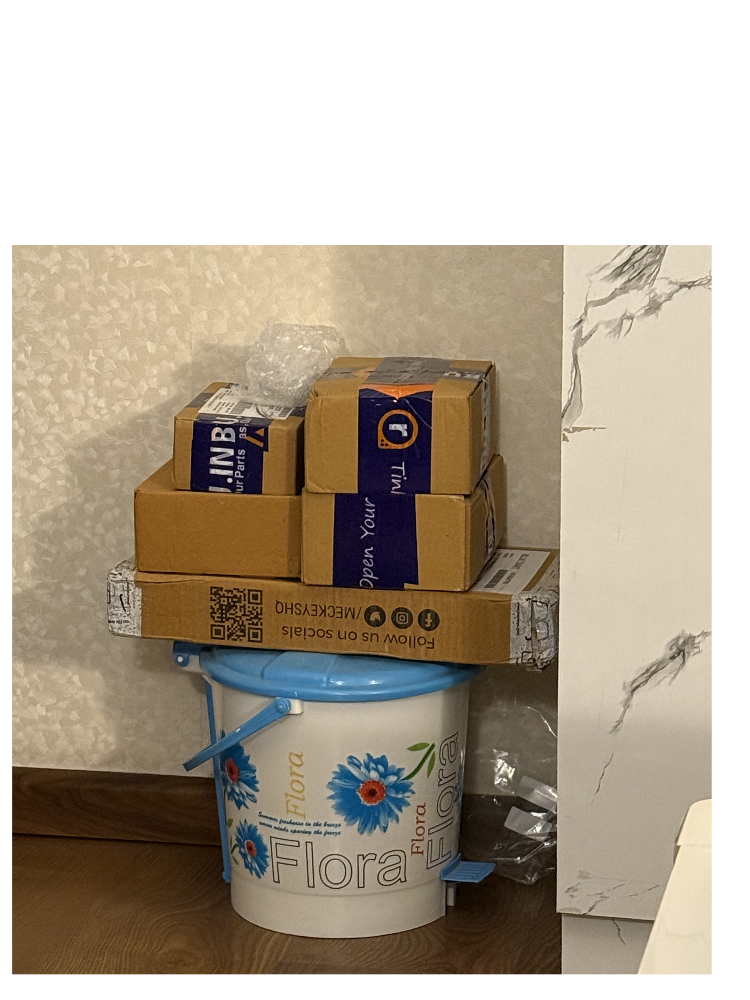

# Sat Sep 26 20:32:19 IST 2026

## BOM

| Item                | Qty     | Cost       | Ordered? | Est. Delivery | Order ID            | Received on    |
|---------------------|---------|------------|----------|---------------|---------------------|----------------|
| PCB (single switch) | 25 * 10 | 1114       | ✓        | 03/10         | 3725547             |                |
| Case                | 1       | 1223       | ✓        | 03/10         | 3725656             | 03/10 12:00 PM |
| Robu.in             | 8       | 3909 (COD) | ✓        | -             | 3725723             | 30/09 01:30 PM |
| OnlyScrews          | 4       | 969        | ✓        | 03/10         | ONLSCR58241         | 03/10 12:00 PM |
| MecKeys             | 1       | 1900 (COD) | ✓        | 01/10         | 200622              | 30/09 01:30 PM |
| StacksKB            | 2       | 3170       | ✓        | 05/10         | 40166               | 01/10 09:44 AM |
| MCU Holder 3d print | 5       | 204        | ✓        |               | 3726653             | 03/10 12:00 PM |
| Amazon              | 2       | 453        | ✓        | 03/10,04/10   | 408-5696479-2547503 | 02/10, 04/10   |

### Robu

| Item                                                                                                                       | Qty | Unit Cost | Total Cost |
|----------------------------------------------------------------------------------------------------------------------------|-----|-----------|------------|
| Promicro NRF52840 Development BoardSKU: R175175                                                                            | 3   | ₹ 799     | ₹ 2397     |
| 1N4148 Surface Mount Zener DiodeSKU: 597387                                                                                | 60  | ₹ 1.84    | ₹ 110.4    |
| 1N4148-Onsemi-100V 1V@10mA 4ns 200mA DO-35 Switching Diodes ROHSSKU: R253700                                               | 60  | ₹ 2.87    | ₹ 172.2    |
| Tactile Push Button Switch 6x6x5 (Pack of 10)SKU: 618182                                                                   | 4   | ₹ 19      | ₹ 76       |
| WLY52535 3.7V 450mAh 1S LiPo Battery – Micro Rechargeable Battery Pack for Wearables / Micro Drone / IoTSKU: 1356581       | 2   | ₹ 299     | ₹ 598      |
| SS12D10G5-SHOU HAN-Direct Insert 2A Single Pole Double Throw (SPDT) 125V 3000 times Plugin Slide Switches ROHSSKU: R235205 | 4   | ₹ 15      | ₹ 60       |
| 28AWG High Quality Ultra Flexible Silicone Wire - BlackSKU: 1420432                                                        | 18  | ₹ 6       | ₹ 108      |
| Solder Wire 0.5mm 50g B Type 35% Tin Content for ElectronicsSKU: 51943                                                     | 1   | ₹ 289     | ₹ 289      |

- Plus delivery cost: Rs. 99

### OnlyScrews

| Item                                             | Qty | Unit Cost | Total Cost |
|--------------------------------------------------|-----|-----------|------------|
| M3 X 16mm Phillips CSK SS 304 Screw - OnlyScrews | 40  | ₹1.80     | ₹72.00     |
| M3 X 8mm Phillips CSK SS 304 Screw - OnlyScrews  | 20  | ₹1.40     | ₹28.00     |
| M2 X 8mm Phillips Round head Laptop Screw        | 171 | ₹2.80     | ₹478.80    |
| 3D Printing Brass Threaded Inserts               | 40  | ₹4.60     | ₹184.00    |

- Item total cost: 762
- Shipping: 69
- Taxes: 137

### MecKeys

| Item                                 | Qty | Cost |
|--------------------------------------|-----|------|
| GMK Modern Bean-Light Keycap (Clone) | 1   | 1900 |

- Subtotal: ₹1,610.17
- Tax: ₹289.83
- Total: ₹1,900.00

### StacksKB

| Item                          | Qty | Price  |
|-------------------------------|-----|--------|
| Gateron Hotswap Sockets       | 42  | ₹420   |
| Gateron Oil King (Pack of 10) | 5   | ₹2,750 |

- Total: ₹3,170.00 (includes ₹483.56 GST)

### Amazon

| Item                                  | Qty | Price |
|---------------------------------------|-----|-------|
| Rubber Feet                           | 1   | ₹150  |
| Copper Wire without enamel (20 guage) | 1   | ₹302  |

- Total: ₹453

---

Total Cost: ₹12,942

Payment Done till now:
- COD: ₹5,809
- Online: ₹7,133

---

Sun Oct  4 02:07:08 IST 2026

- Received all the packages except for the PCB and decided to open all of them up to verify the
  contents

	

- As we all know, these builds can never go without any issues in-between
- So, I have figured out 2 issues as of now:
	1. I had ordered only right side of the 3d printed case. The left half is pending.
	2. I ordered SPDT switch for power-on but that is too big and the one i got for the ferris (SMD)
	   is too small. Not able to find the one that the original creator of the cygnus used.
